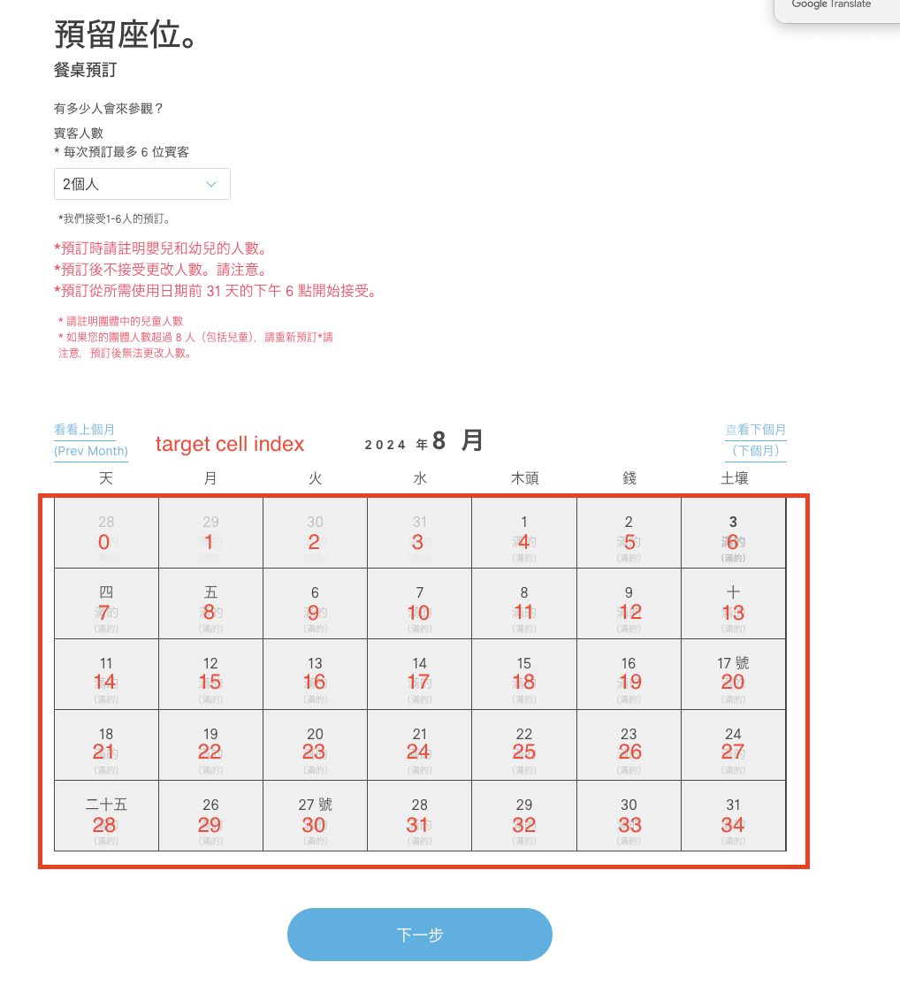

# pokemoncafe

1. npm install
2. setup arguments in `src/main.ts`
- `NUM_PEOPLE` (required)
- `NAME` (required)
- `PHONE` (required)
- `EMAIL` (required)
- `TARGET_CELL_INDEX` (it's more faster, check the date's index you want)

3. npm run build (note: if you setup new arguments, step 2 would need to redo)
4. npm run start (execution, note: it can be reserved at 17:00 UTC+8)
